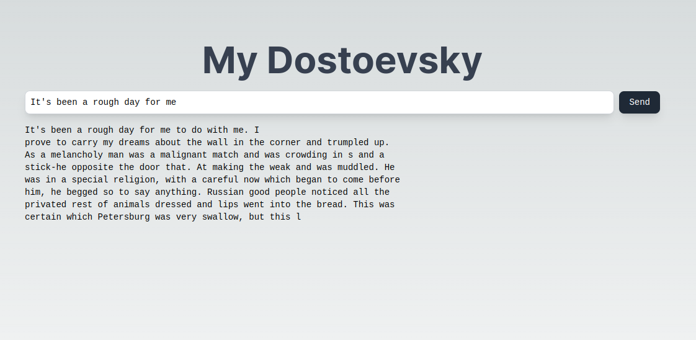

<p align="center">
  <a href="https://my-dostoyevsky.vercel.app/" ></a>
</p>

*Send a message to an NLP agent trained with Dostoevsky work! See a demo [here](https://my-dostoyevsky.vercel.app/).*

## Backend
- Initial setup:
```bash
cd backend
pipenv shell
pipenv install --dev
```

- Makefile help:
```bash
make
```

- To execute tests:
```bash
pytest
```

- To build and run docker image with FastAPI app:
```bash
make dev-build-image tag=<imagetag>
make dev-run tag=<imagetag>
```
Set up the `imageatag` of your preference, for example: `fyodor:v1`. The app will be available at http://localhost:8000. This container is ready for deployment, for example to [Cloud Run](https://cloud.google.com/run?hl=es-419).

## Frontend

- Initial setup:
```bash
cd fyodor
npm install
```

After that, a file called `env.local` should be created and stored inside the folder `fyodor`, the file should have this structure:

```
NEXT_PUBLIC_MODEL_API_PROD=<url of the deployed model>
```

To know more about this read [here](https://nextjs.org/docs/pages/building-your-application/configuring/environment-variables)

- To execute in dev mode:
```bash
npm run dev
```

## TODO
- Loading state in the frontend
- Add description into frontend
- Animation of the complete text
